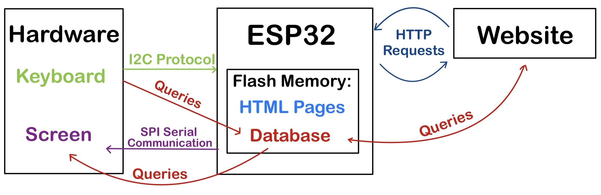

# IoT Smart Vending Machine

[](https://www.espressif.com/en/products/socs/esp32)
[](https://www.altium.com/)
[](https://www.sqlite.org/)
[](LICENSE)

A complete IoT vending machine system with **custom PCB design**, **ESP32 microcontroller**, **web interface**, and **SQLite database** for the ETRO laboratory snack bar.

---

## Project Overview

This project modernizes the ETRO laboratory snack bar by replacing the traditional paper-based ordering system with a smart vending machine. Users authenticate via keypad, select snacks from an e-paper display, and track orders through a web interface.

### Key Features

- Custom PCB Design - Double-layer PCB with ESP32, MCP23008 I/O expander
- Low-Power E-Paper Display - 4.37" 4-color Waveshare screen
- Web Interface - 9 responsive HTML pages
- Secure Database - SQLite with SHA-256 password hashing
- WiFi Connectivity - ESP32 web server at http://snackbaresp32/home
- Multi-User Support - User authentication and order tracking

---

## System Architecture

### Hardware Components

| Component | Model | Function |
|-----------|-------|----------|
| Microcontroller | DFRobot FireBeetle ESP32 | WiFi, web server, 16MB flash |
| Display | Waveshare 4.37" E-Paper | Low-power menu display |
| Input | 4x4 Keypad Matrix | User authentication |
| I/O Expander | MCP23008 (8-bit) | I2C keypad communication |

### Circuit Schematic


*Complete circuit schematic showing ESP32, I/O expander, keypad matrix, and e-paper connections designed in Altium Designer.*

### PCB Layout


*Double-layer PCB layout with optimized trace routing and component placement.*

---

## Software Architecture

### System Workflow


*Complete order flow: Menu → Authentication → Selection → Confirmation → Database Update*



*System-wide data flow between hardware, web server, and database.*

### Technology Stack

- **Embedded C/C++** - Hardware control & system logic
- **HTML/CSS** - Web interface (9 pages)
- **SQLite** - Relational database
- **ESP32 AsyncWebServer** - HTTP server
- **I2C/SPI** - Hardware communication protocols

---

## Web Interface

The system provides **9 comprehensive web pages**:

| Page | Screenshot | Description |
|------|------------|-------------|
| Home |  | Landing page with system introduction |
| Login |  | User authentication (ID + PIN) |
| User Dashboard |  | Order history & payment status |
| Admin Dashboard |  | Monthly orders overview |

---

## Database Schema

The database consists of **4 interconnected tables**:

- **Customer** - User information (Client_ID, Pin_Code hashed, Email, Name)
- **Product** - Snack inventory (Product_ID, Name, Unit_Price, Stock)
- **Orders** - Order tracking (Order_ID, Date, Status, Client_ID)
- **Product_Order** - Many-to-many relationship (Order_ID, Product_ID, Quantity)

### Security Features

- SHA-256 password hashing
- Session token management
- SQL injection prevention

---

## Project Structure
```
IOT-Project-2023-2024/
├── src/                   # Embedded C/C++ code
│   └── Biometric_Project_V5.ino
│
├── web/                   # HTML pages (9 total)
│   ├── home.html
│   ├── login.html
│   ├── userpage.html
│   └── ...
│
├── database/              # SQLite database
│   ├── snacks.db
│   └── snacks.sqbpro
│
└── docs/                  # Documentation
    ├── diagrams/          # Hardware schematics
    └── images/            # Web interface screenshots
```

---

## Getting Started

### Hardware Setup

1. Assemble PCB (ESP32, MCP23008, capacitors)
2. Connect keypad to I/O Header 1
3. Connect e-paper to I/O Header 3
4. Power via USB or lithium battery

### Software Installation
```bash
# 1. Clone repository
git clone https://github.com/GlodiSala/IOT-Project-2023-2024.git
cd IOT-Project-2023-2024

# 2. Configure WiFi (edit src/Biometric_Project_V5.ino)
#define WIFI_SSID "your_network"
#define WIFI_PASSWORD "your_password"

# 3. Upload to ESP32 via Arduino IDE
```

### Access Web Interface

1. Connect to configured WiFi network
2. Navigate to: **http://snackbaresp32/home**
3. Use credentials from database

---

## Technical Specifications

### Hardware

- **Microcontroller:** ESP32 (240MHz, 16MB Flash)
- **Communication:** I2C, SPI, WiFi
- **Display:** 4.37" E-Paper, 512x368 pixels, 4-color
- **Input:** 4x4 matrix keypad (16 keys)
- **Power:** USB 5V or Li-Ion battery (3.7V)

### Software

- **Language:** C/C++ (Arduino framework)
- **Database:** SQLite3 (embedded)
- **Security:** SHA-256 hashing
- **Memory Usage:** 99% program memory, HTML/DB in flash

---

## Challenges & Solutions

| Challenge | Solution |
|-----------|----------|
| E-Paper Update Speed (14s) | Added LED status indicator |
| Memory Limitations (99% usage) | Stored HTML/DB in flash memory |
| Component Integration | Custom PCB design |

---

## Authors

**Miranda Ndayisaba**  
Email: miranda.ndayisaba@ulb.be  
Institution: ULB-VUB Brussels

**Glodi Sala Mangituka**  
Email: glodi.sala.mangituka@ulb.be  
LinkedIn: [glodi-sala-mangituka](https://linkedin.com/in/glodi-sala-mangituka)  
GitHub: [GlodiSala](https://github.com/GlodiSala)

---

## Academic Context

**Course:** PROJ-H415 - Project Electronics and Telecommunication  
**Institution:** Universite Libre de Bruxelles (ULB) / Vrije Universiteit Brussel (VUB)  
**Year:** 2023-2024

**Supervisor:** Ir. Jonathan Vrijsen, ETRO Laboratory

---

## License

This project is for **academic purposes only**.  
All rights reserved to the authors and ULB-VUB Brussels.

---

## Acknowledgments

Special thanks to:
- ETRO Laboratory researchers
- Ir. Jonathan Vrijsen for supervision
- ULB-VUB teaching staff
- Component manufacturers: DFRobot, Waveshare, Microchip

---

## References

1. [ESP32 Documentation](https://www.espressif.com/en/products/socs/esp32)
2. [SQLite Documentation](https://www.sqlite.org/docs.html)
3. [Altium Designer](https://www.altium.com/documentation)
4. [Waveshare E-Paper](https://www.waveshare.com/wiki/4.37inch_e-Paper_Module_(G)_Manual)

---

If you find this project interesting, please give it a star!