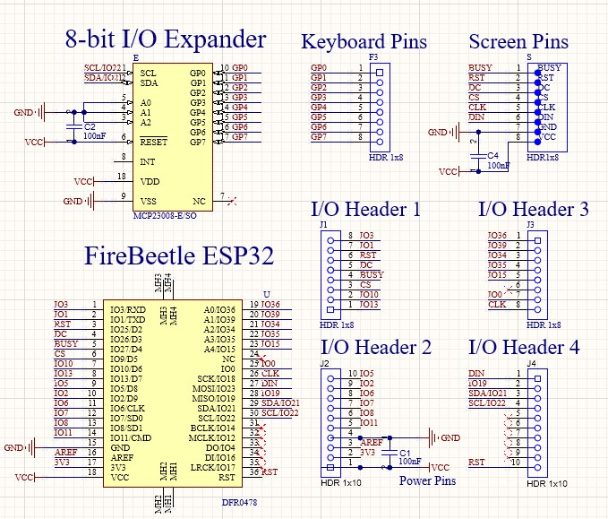
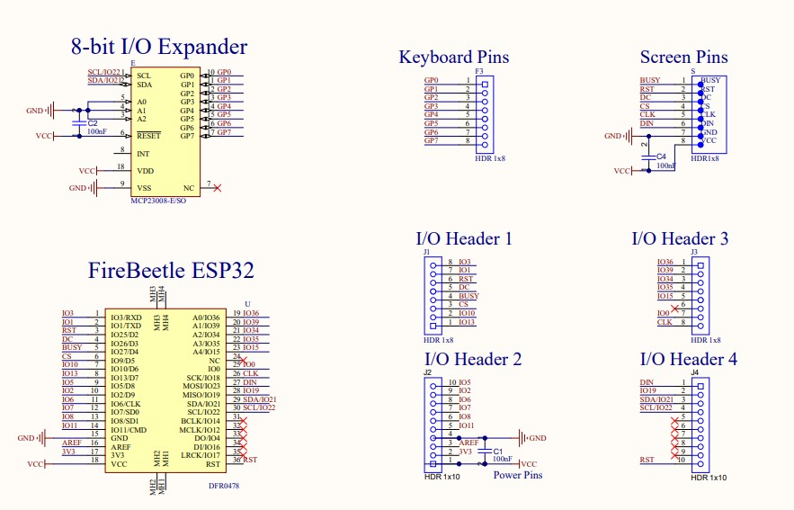
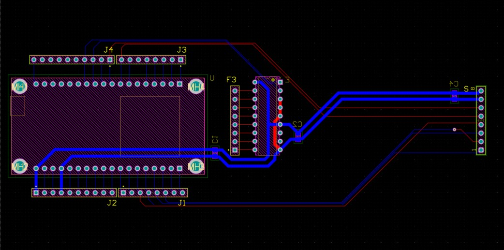
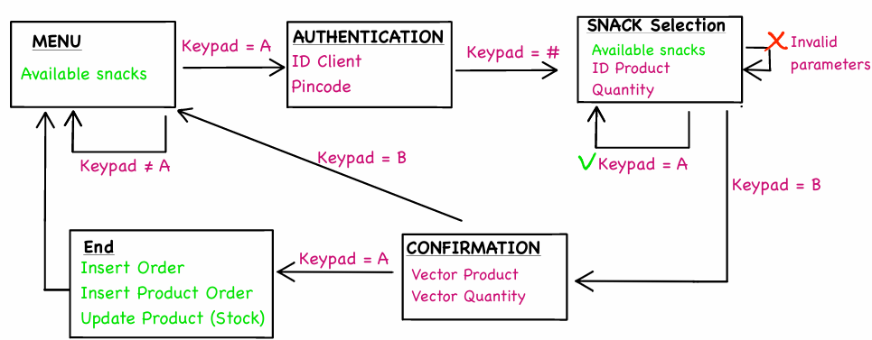
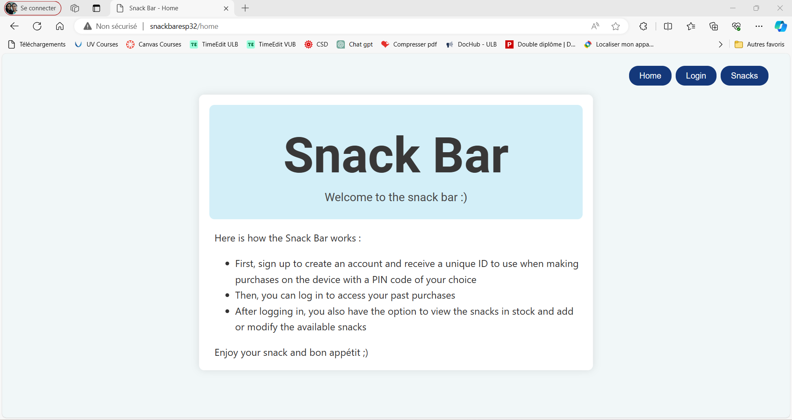
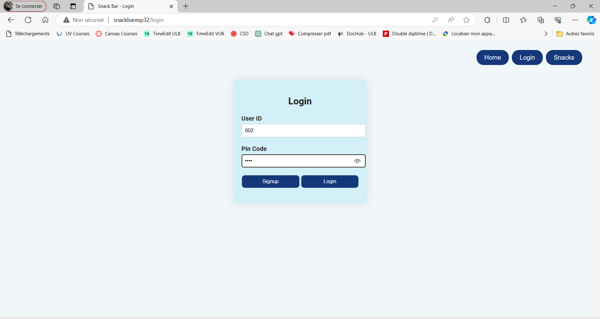
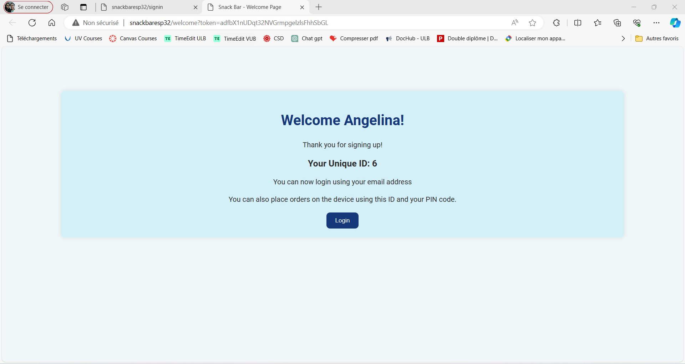
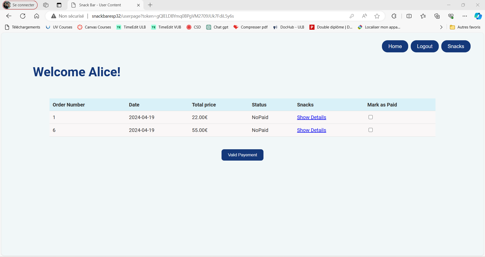
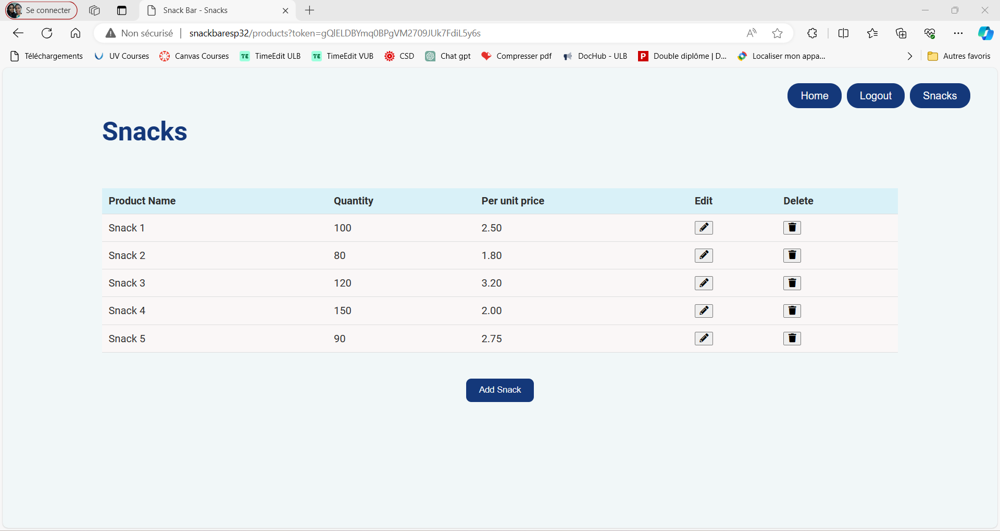
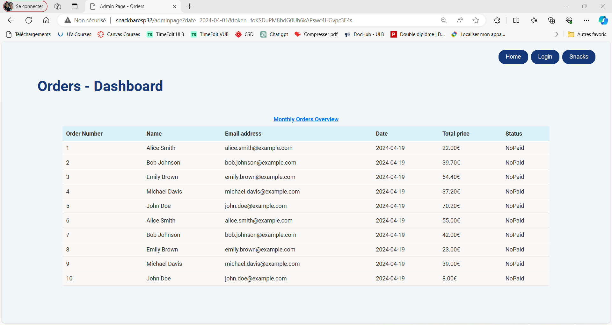

# 🛒 IoT Smart Vending Machine

[](https://www.espressif.com/en/products/socs/esp32)
[](https://www.altium.com/)
[](https://www.sqlite.org/)
[](LICENSE)

A complete IoT vending machine system with **custom PCB design**, **ESP32 microcontroller**, **web interface**, and **SQLite database** for the ETRO laboratory snack bar.

---

## 📋 Project Overview

This project modernizes the ETRO laboratory snack bar by replacing the traditional paper-based ordering system with a smart vending machine. Users authenticate via keypad, select snacks from an e-paper display, and track orders through a web interface.

### ✨ Key Features

- ✅ **Custom PCB Design** - Double-layer PCB with ESP32, MCP23008 I/O expander
- ✅ **Low-Power E-Paper Display** - 4.37" 4-color Waveshare screen
- ✅ **Web Interface** - 9 responsive HTML pages
- ✅ **Secure Database** - SQLite with SHA-256 password hashing
- ✅ **WiFi Connectivity** - ESP32 web server at `http://snackbaresp32/home`
- ✅ **Multi-User Support** - User authentication and order tracking

---

## 🏗️ System Architecture

### Hardware Components

| Component | Model | Function |
|-----------|-------|----------|
| **Microcontroller** | DFRobot FireBeetle ESP32 | WiFi, web server, 16MB flash |
| **Display** | Waveshare 4.37" E-Paper (4-color) | Low-power menu display |
| **Input** | 4x4 Keypad Matrix | User authentication & selection |
| **I/O Expander** | MCP23008 (8-bit) | I2C keypad communication |

### Circuit Schematic


*Complete circuit schematic showing ESP32, I/O expander, keypad matrix, and e-paper connections designed in Altium Designer.*


*Enlarged view of component interconnections with net labels.*

### PCB Layout


*Double-layer PCB layout with optimized trace routing and component placement.*


*3D visualization of the assembled PCB.*

---

## 💻 Software Architecture

### System Components

1. **Hardware Management** (C/C++)
   - Keypad input via I2C interrupts
   - E-paper display via SPI (14s update time)
   - LED status indicator

2. **Web Server** (HTTP)
   - 9 HTML pages in flash memory
   - GET/POST request handling
   - Session management with tokens

3. **Database** (SQLite)
   - 4 tables: Customer, Product, Orders, Product_Order
   - SHA-256 password hashing
   - Relational data integrity

### System Workflow


*Complete order flow: Menu → Authentication → Selection → Confirmation → Database Update*


*System-wide data flow between hardware, web server, and database.*

---

## 🌐 Web Interface

The system provides **9 comprehensive web pages** for complete functionality:

### User Pages

| Page | Screenshot | Description |
|------|------------|-------------|
| **Home** |  | Landing page with system introduction |
| **Login** |  | User authentication (ID + PIN) |
| **Signup** |  | New user registration |
| **Welcome** |  | Registration confirmation with unique ID |
| **User Dashboard** |  | Order history & payment status |
| **Order Details** |  | Detailed order breakdown |

### Admin Pages

| Page | Screenshot | Description |
|------|------------|-------------|
| **Snacks Stock** |  | Inventory management |
| **Add Snack** |  | Add new products to database |
| **Admin Dashboard** |  | Monthly orders overview |

---

## 🗄️ Database Schema
```
┌─────────────────┐      ┌──────────────────┐
│  Customer       │      │  Product         │
├─────────────────┤      ├──────────────────┤
│ Client_ID (PK)  │      │ Product_ID (PK)  │
│ Pin_Code (Hash) │      │ Name             │
│ Email_Address   │      │ Unit_Price       │
│ Name, Surname   │      │ Stock            │
└─────────────────┘      └──────────────────┘
         │                        │
         │                        │
         â–¼                        â–¼
┌─────────────────┐      ┌──────────────────┐
│  Orders         │◄────►│ Product_Order    │
├─────────────────┤      ├──────────────────┤
│ Order_ID (PK)   │      │ Order_ID (FK)    │
│ Date            │      │ Product_ID (FK)  │
│ Status          │      │ Quantity         │
│ Client_ID (FK)  │      └──────────────────┘
└─────────────────┘
```

### Security Features

- ✅ **SHA-256 Hashing** - PIN codes never stored in plaintext
- ✅ **Session Tokens** - Random tokens prevent session hijacking
- ✅ **Input Validation** - SQL injection prevention

---

## 📂 Project Structure
```
IOT-Project-2023-2024/
├── src/                   # Embedded C/C++ code
│   ├── main.cpp          # Main program
│   ├── hardware.cpp      # Keypad & E-paper drivers
│   ├── webserver.cpp     # HTTP request handlers
│   └── database.cpp      # SQLite queries
│
├── web/                   # HTML pages (9 total)
│   ├── home.html
│   ├── login.html
│   ├── user.html
│   └── ...
│
├── hardware/              # PCB design files
│   ├── altium/           # Altium Designer project
│   ├── schematic.pdf
│   └── gerber/           # Manufacturing files
│
├── docs/                  # Documentation
│   ├── diagrams/         # Hardware schematics
│   ├── images/           # Web interface screenshots
│   └── Project_Report.pdf
│
└── database/
    └── schema.sql        # Database structure
```

---

## 🚀 Getting Started

### Hardware Setup

1. **Assemble PCB**
   - Solder ESP32, MCP23008, capacitors
   - Connect keypad to I/O Header 1
   - Connect e-paper to I/O Header 3

2. **Power Configuration**
   - USB or external lithium battery
   - Integrated battery management circuit

### Software Installation
```bash
# 1. Clone repository
git clone https://github.com/GlodiSala/IOT-Project-2023-2024.git
cd IOT-Project-2023-2024

# 2. Install dependencies (PlatformIO)
pio lib install

# 3. Configure WiFi (edit config.h)
#define WIFI_SSID "your_network"
#define WIFI_PASSWORD "your_password"

# 4. Upload to ESP32
pio run --target upload
```

### Access Web Interface

1. Connect to WiFi network configured in `config.h`
2. Navigate to: **http://snackbaresp32/home**
3. Default admin credentials in documentation

---

## 🛠️ Technical Specifications

### Hardware

- **Microcontroller:** ESP32 (240MHz, 16MB Flash)
- **Communication:** I2C (keypad), SPI (display), WiFi
- **Display:** 4.37" E-Paper, 512×368 pixels, 4-color
- **Input:** 4×4 matrix keypad (16 keys)
- **Power:** USB 5V or Li-Ion battery (3.7V)

### Software

- **Language:** C/C++ (Arduino framework)
- **Web Server:** ESP32 AsyncWebServer
- **Database:** SQLite3 (embedded)
- **Security:** SHA-256 cryptographic hashing
- **Memory Usage:** 99% program memory, files in flash

---

## 📊 Performance & Challenges

### Achievements

✅ Fully functional vending machine  
✅ Secure user authentication  
✅ Real-time inventory management  
✅ Responsive web interface  
✅ NIST-compliant encryption  

### Challenges Solved

⚠️ **E-Paper Update Speed (14s)** → Added LED status indicator  
⚠️ **Memory Limitations (99% usage)** → Stored HTML/DB in flash  
⚠️ **Component Integration** → Custom PCB design  

### Future Improvements

- 💡 Dual ESP32 setup (one for web, one for hardware)
- 💡 Faster e-paper display (4.2" with 5s update)
- 💡 Bluetooth communication between controllers

---

## 👥 Authors

**Miranda Ndayisaba**  
📧 miranda.ndayisaba@ulb.be  
🏫 ULB-VUB Brussels

**Glodi Sala Mangituka**  
📧 glodi.sala.mangituka@ulb.be  
🔗 [LinkedIn](https://linkedin.com/in/glodi-sala-mangituka)  
🐙 [GitHub](https://github.com/GlodiSala)

---

## 🎓 Academic Context

**Course:** PROJ-H415 - Project Electronics and Telecommunication  
**Institution:** Université Libre de Bruxelles (ULB) / Vrije Universiteit Brussel (VUB)  
**Academic Year:** 2023-2024

### Supervisor

**Ir. Jonathan Vrijsen**  
Project Supervisor, ETRO Laboratory

---

## 📜 License

This project is for **academic purposes only**.  
All rights reserved to the authors and ULB-VUB Brussels.

---

## 🙏 Acknowledgments

Special thanks to:
- **ETRO Laboratory** researchers for continuous support
- **Ir. Jonathan Vrijsen** for guidance and supervision
- **ULB-VUB** teaching staff
- Component manufacturers: DFRobot, Waveshare, Microchip

---

## 📚 Documentation & Resources

- 📄 **[Full Project Report](docs/Project_Report.pdf)** - Complete technical documentation
- 🔧 **[Hardware Schematics](docs/diagrams/)** - PCB design files
- 💻 **[Source Code](https://github.com/GlodiSala/IOT-Project-2023-2024)** - Complete codebase
- 🌐 **[Web Interface Screenshots](docs/images/)** - All 9 pages

### References

1. [ESP32 Technical Reference](https://www.espressif.com/en/products/socs/esp32)
2. [SQLite Documentation](https://www.sqlite.org/docs.html)
3. [Altium Designer](https://www.altium.com/documentation)
4. [Waveshare E-Paper](https://www.waveshare.com/wiki/4.37inch_e-Paper_Module_(G)_Manual)

---

⭐ **If you find this project interesting, please give it a star!**

📧 **Questions?** Open an issue or contact the authors.

🚀 **Want to contribute?** Fork the repository and submit a pull request.
